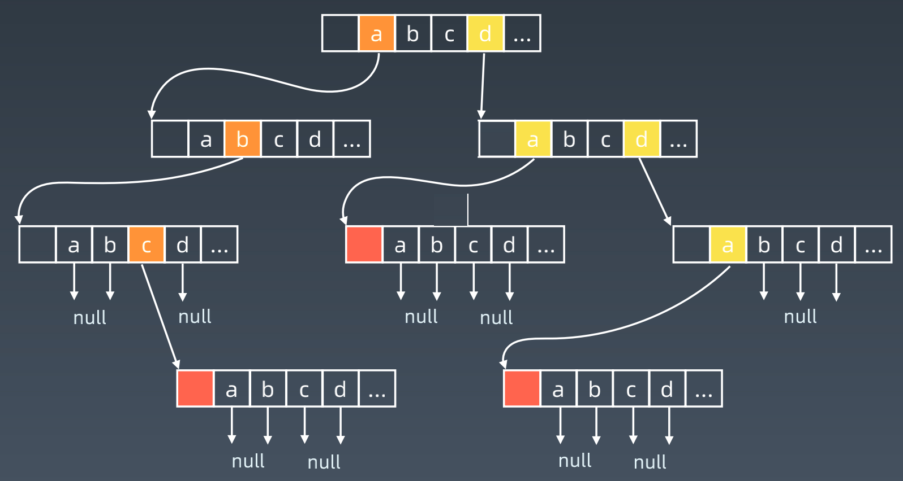
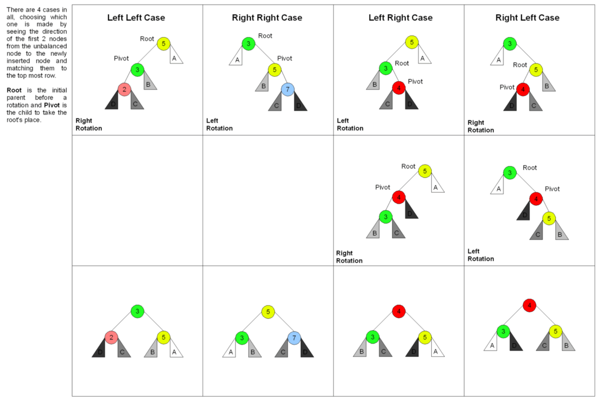
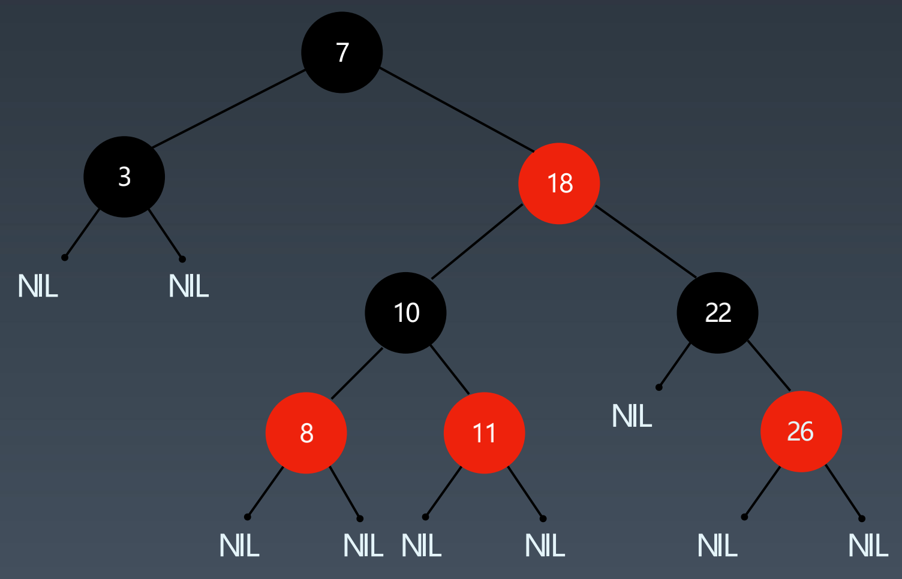

### 第七周学习笔记

#### Trie 树
1. Trie 树性质：
	* 每个节点表示一个字母，而非整个单词。根节点不表示任何字母。
	* 每个节点用一个字段来标记自己是否是叶节点（单词的最后一个字母）。
	* 每个节点用一个数组存储所有可能的下一个节点（即单词的下一个字母）的指针。所以可以将 Trie 树看作一棵 26 叉树（26 位字母表中的字母数）。
	* 从根节点到任意一个叶节点的路径上所有节点的字母按顺序拼成一个完整的单词。
2. Trie 树内部实现
	
3. Trie 的核心思想：
	* 用空间换时间。
	* 利用字符串的公共前缀来降低查询的时间开销，常被搜索引擎用于按已经输入的前缀提示完整单词。
	* 查询一个单词的时间只与该单词的长度有关，与树中单词的个数无关。

#### 并查集
1. 基本操作：
	* **makeSet(s)**：建立一个新的并查集，其中包含 s 个单元素集合。
	* **unionSet(x, y)**：把元素 x 和元素 y 所在的集合合并，要求 x 和 y 所在的集合不相交，如果相交则不合并。
	* **find(x)**：找到元素 x 所在的集合的代表，该操作也可以用于判断两个元素是否位于同一个集合，只要将它们各自的代表比较一下就可以了。

#### AVL 树
1. AVL 树定义：平衡因子（左右子树的高度差）为 -1，0，1 的二叉搜索树。
2. 进行平衡的四种操作: 右旋、左旋、左右旋、右左旋
	

#### 红黑树
1. 红黑树：一种近似平衡的二叉搜索树，任何一个节点的左右子树的高度差小于两倍。定义如下：
	* 每个节点要么是红色、要么是黑色
	* 根节点为黑色
	* 每个叶节点（NIL节点、空节点）为黑色
	* 不能有相邻的两个红色节点
	* 从任一结点到其每个叶子的所有路径都包含相同数目的黑色结点
2. 红黑树示例：
   

#### AVL 树 VS 红黑树
1. AVL 树更严格，查询速度更快
2. 红黑树插入与删除操作更快
3. 额外的存储信息：AVL 用 Integer 存平衡因子；红黑树只需要一个 Bit 存颜色
4. 使用场景：AVL 树用于语言类库的 map、set等实现；红黑树用于数据库（写少查多）
